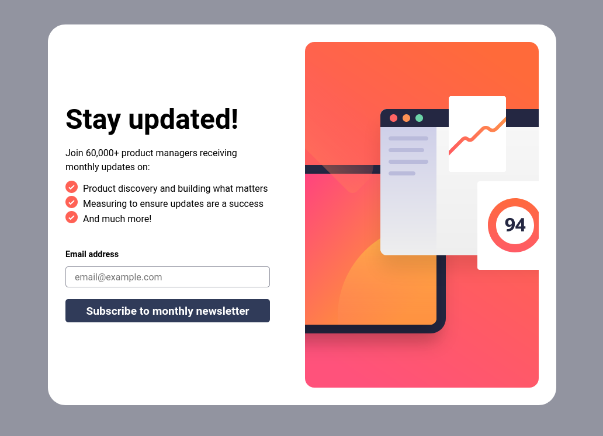

# Frontend Mentor - Newsletter sign-up form with success message solution

This is a solution to the [Newsletter sign-up form with success message challenge on Frontend Mentor](https://www.frontendmentor.io/challenges/newsletter-signup-form-with-success-message-3FC1AZbNrv). Frontend Mentor challenges help you improve your coding skills by building realistic projects. 

## Table of contents

- [Overview](#overview)
  - [The challenge](#the-challenge)
  - [Screenshot](#screenshot)
  - [Links](#links)
- [My process](#my-process)
  - [Built with](#built-with)
  - [What I learned](#what-i-learned)
  - [Continued development](#continued-development)
  - [Useful resources](#useful-resources)
- [Author](#author)
- [Acknowledgments](#acknowledgments)

## Overview

### The challenge

Users should be able to:

- Add their email and submit the form
- See a success message with their email after successfully submitting the form
- See form validation messages if:
  - The field is left empty
  - The email address is not formatted correctly
- View the optimal layout for the interface depending on their device's screen size
- See hover and focus states for all interactive elements on the page

### Screenshot

### Links

- Solution URL: (git@github.com:francobwogo/newsletter.git)
- Live Site URL: (https://francobwogo.github.io/newsletter)

## My process

### Built with

- Semantic HTML5 markup
- CSS custom properties
- Flexbox
- CSS Grid
- Mobile-first workflow
- Javascript

### What I learned

HTML, CSS and Javascript

### Continued development

HTML, CSS and Javascript

### Useful resources

- [MDN](https://developer.mozilla.org/en-US/) - HTML and CSS references.
- [A Modern CSS Reset](https://piccalil.li/blog/a-modern-css-reset) - CSS Reset.
- The NetNinja - CSS Tutorial For Beginners 46 - Multiple Backgrounds(https://www.youtube.com/watch?v=Sj7Hs94uZjE) - How to work with multiple backgrounds.
- Kevin Powell - Responsive design made easy (https://www.youtube.com/watch?v=bn-DQCifeQQ&t=2119s) - This helped me learn responsive web design. Kevin's workflow is easy to learn and use.
- The Odin Project (https://www.theodinproject.com/).

## Author

- Frontend Mentor - [@francobwogo](https://www.frontendmentor.io/profile/francobwogo)

## Acknowledgments

Kevin Powell - CSS